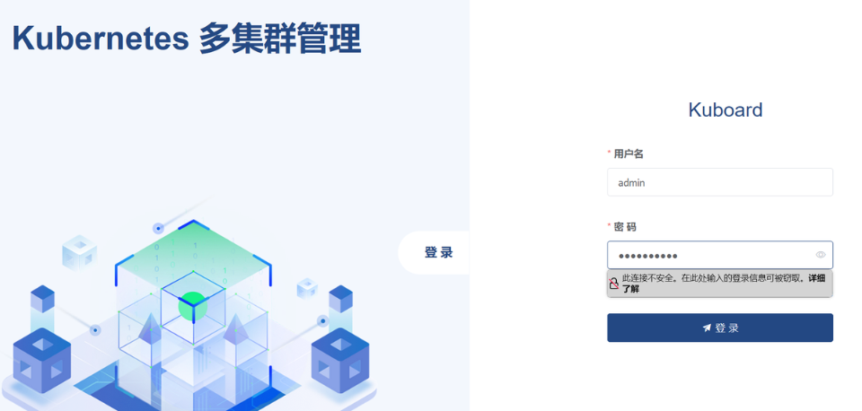
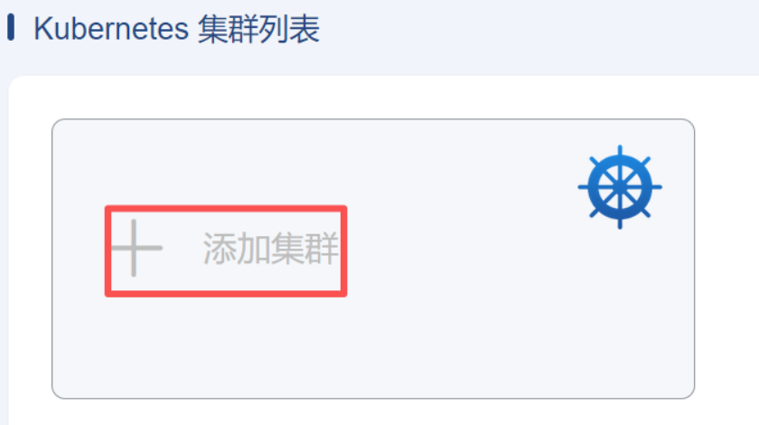
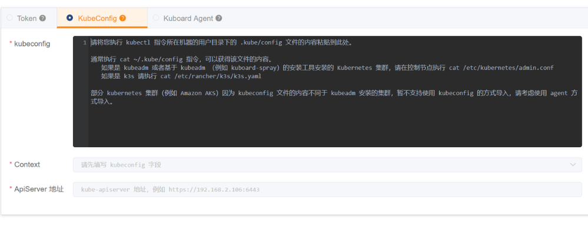
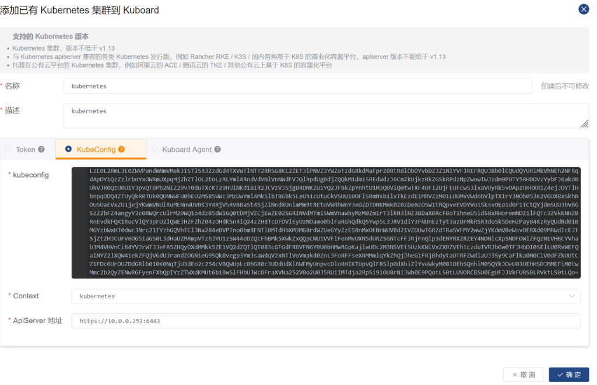
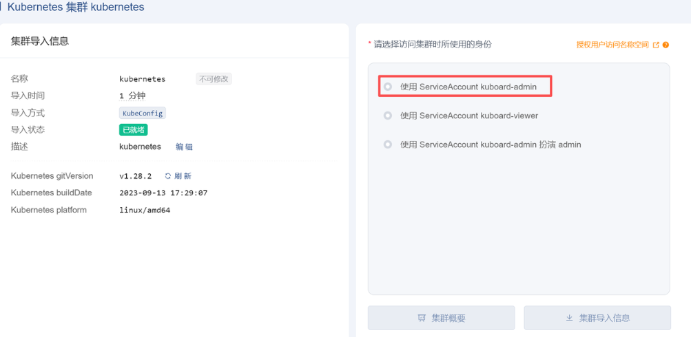
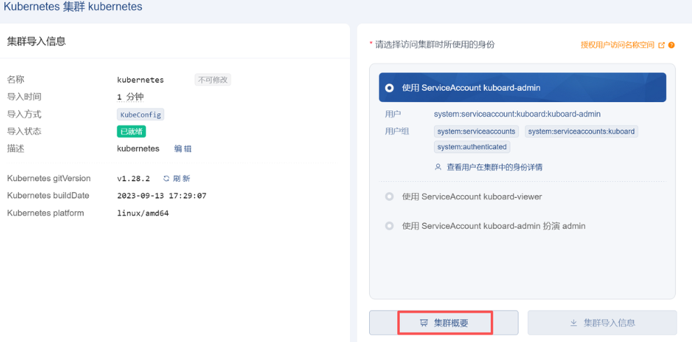
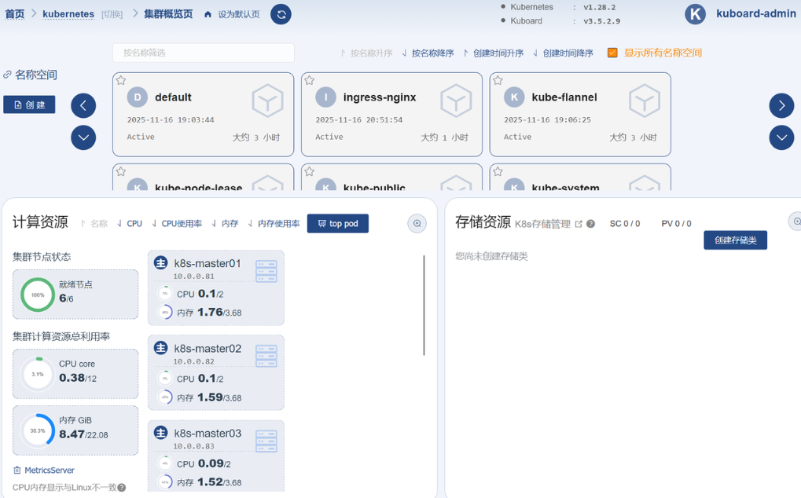

# 环境规划

**OS**: Ubuntu 22.04 LTS
**Docker**: 23.0, CGroup Driver: systemd
**Kubernetes**: v1.27

- **CRI**: cri-dockerd
- **CNI**:  Calico

**网络环境**

- 节点网络: 10.0.0.0/24
- Pod网络: 10.244.0.0/16
- Service网络: 10.96.0.0/12

| IP地址    | 主机名       | 角色   |
| --------- | ------------ | ------ |
| 10.0.0.20 | k8s-master01 | master |
| 10.0.0.21 | k8s-node01   | worker |
| 10.0.0.22 | k8s-node02   | worker |
| 10.0.0.23 | k8s-node03   | worker |

# 安装前提

```shell
# 设置时区
timedatectl set-timezone Asia/Shanghai
# 安装chrony服务并配置好时间同步
apt update
apt install chrony -y
vim /etc/chrony/chrony.conf
server ntp1.aliyun.com iburst
# 安装好后默认已经开机自动启动 
systemctl enable --now chrony.service
# 重启chrony服务
systemctl restart chrony
# 检查时钟服务可用性
chronyc sources -v
# 禁止使用swap
systemctl --type swap
  UNIT          LOAD   ACTIVE SUB    DESCRIPTION
  swap.img.swap loaded active active /swap.img
systemctl mask swap.img.swap
Created symlink /etc/systemd/system/swap.img.swap → /dev/null.
swapoff -a
# 注释掉swap行
vim /etc/fstab
#/swap.img      none    swap    sw      0       0
# 配置网桥模块和内核参数
# 1. 配置系统参数
sudo tee /etc/modules-load.d/k8s.conf << EOF
br_netfilter
overlay
EOF

# 2. 加载模块
sudo modprobe br_netfilter
sudo modprobe overlay

# 3. 配置网络参数
sudo tee /etc/sysctl.d/k8s.conf << EOF
net.bridge.bridge-nf-call-iptables = 1
net.bridge.bridge-nf-call-ip6tables = 1
net.ipv4.ip_forward = 1
vm.swappiness=0
kernel.shmmni = 32000
kernel.msgmnb = 163840
kernel.msgmax = 81920
net.ipv4.tcp_keepalive_time = 300
net.ipv4.tcp_keepalive_probes = 10
net.ipv4.tcp_keepalive_intvl = 30
net.ipv4.ip_local_port_range = 1024 65535
net.core.somaxconn = 4096
net.ipv4.tcp_max_syn_backlog = 8192
net.core.netdev_max_backlog = 30000
net.core.wmem_default = 16777216
net.core.rmem_max=16777216
net.core.wmem_max=16777216
net.ipv4.tcp_mem = 4096000 4096000 4096000
net.ipv4.tcp_rmem=4096 87380 16777216
net.ipv4.tcp_wmem=4096 87380 16777216
net.ipv4.tcp_fin_timeout = 20
net.ipv4.tcp_tw_reuse = 1
net.ipv4.tcp_synack_retries = 2
net.ipv4.tcp_syn_retries = 2
net.ipv4.ip_forward=1
EOF

# 4. 应用配置
sudo sysctl --system
# 配置ulimit
sudo tee /etc/security/limits.d/k8s.conf << EOF
root soft nofile 65536
root hard nofile 65536
root soft nproc 65536
root hard nproc 65536
root soft core 50000000
root hard core 50000000
EOF

# 关闭防火墙
ufw disable
ufw status
```

安装docker

```shell
wget http://192.168.100.200/soft/docker/install_docker.tar
sh install_docker.sh
mkdir /etc/docker/
sudo tee /etc/docker/daemon.json << EOF
{
  "registry-mirrors": [
    "https://docker.1ms.run"
  ],
  "exec-opts": ["native.cgroupdriver=systemd"],
  "log-driver": "json-file",
  "log-opts": {
    "max-size": "200m"
  },
  "storage-driver": "overlay2"  
}
EOF
systemctl daemon-reload
systemctl start docker.service
systemctl enable docker.service
```

安装cri-dockerd

Kubernetes自v1.24移除了对docker-shim的支持，而Docker Engine默认又不支持CRI规范，因而二者将无法直接完成整合。为此，Mirantis和Docker联合创建了cri-dockerd项目，用于为Docker Engine提供一个能够支持到CRI规范的垫片，从而能够让Kubernetes基于CRI控制Docker 

```
curl -LO https://github.com/Mirantis/cri-dockerd/releases/download/v0.3.21/cri-dockerd_0.3.21.3-0.debian-bookworm_amd64.deb
apt install ./cri-dockerd_0.3.21.3-0.debian-bookworm_amd64.deb -y
systemctl status cri-docker.service
```

配置DNS解析（在DNS服务器配置）

```shell
vim /etc/bind/rklink.cn.zone
kubeapi A       10.0.0.20
k8s-master01    A       10.0.0.20
k8s-node01      A       10.0.0.21
k8s-node02      A       10.0.0.22
k8s-node03      A       10.0.0.23
```

安装kubelet、kubeadm和kubectl

```shell
apt update -y && apt install -y apt-transport-https curl
curl -fsSL https://mirrors.aliyun.com/kubernetes/apt/doc/apt-key.gpg | apt-key add -
cat <<EOF >/etc/apt/sources.list.d/kubernetes.list
deb https://mirrors.aliyun.com/kubernetes/apt/ kubernetes-xenial main
EOF
apt update -y
apt install -y kubelet kubeadm kubectl
systemctl enable kubelet
```

整合kubelet和cri-dockerd

仅支持CRI规范的kubelet需要经由遵循该规范的cri-dockerd完成与docker-ce的整合。

配置cri-dockerd，确保其能够正确加载到CNI插件。编辑/usr/lib/systemd/system/cri-docker.service文件，确保其[Service]配置段中的ExecStart的值类似如下内容。

配置kubelet，为其指定cri-dockerd在本地打开的Unix Sock文件的路径，该路径一般默认为“/run/cri-dockerd.sock“。编辑文件/etc/sysconfig/kubelet，为其添加 如下指定参数

提示：若/etc/sysconfig目录不存在，则需要先创建该目录。

```shell
# 配置cri-dockerd
vim /usr/lib/systemd/system/cri-docker.service
ExecStart=/usr/bin/cri-dockerd
 --container-runtime-endpoint fd:// --network-plugin=cni 
--cni-bin-dir=/opt/cni/bin --cni-cache-dir=/var/lib/cni/cache 
--cni-conf-dir=/etc/cni/net.d

systemctl daemon-reload && systemctl restart cri-docker.service
# 配置kubelet
mkdir -p /etc/sysconfig
vim /etc/sysconfig/kubelet
KUBELET_KUBEADM_ARGS="--container-runtime=remote --container-runtime-endpoint=/run/cri-dockerd.sock"
```

# 安装Kubernetes

```shell
# coredns依赖pause:3.6默认从registry.k8s.io下载需要手动处理
docker pull registry.aliyuncs.com/google_containers/pause:3.6
docker tag registry.aliyuncs.com/google_containers/pause:3.6 registry.k8s.io/pause:3.6
```

下载镜像

```shell
kubeadm config images pull --cri-socket unix:///run/cri-dockerd.sock
```

## 初始化第一个主节点

只需要在主节点执行

```shell
kubeadm init --control-plane-endpoint kubeapi.rklink.cn --kubernetes-version=v1.28.2 --pod-network-cidr=10.244.0.0/16 --service-cidr=10.96.0.0/12 --token-ttl=0 --cri-socket unix:///run/cri-dockerd.sock --upload-certs --image-repository=registry.aliyuncs.com/google_containers

mkdir -p $HOME/.kube
sudo cp -i /etc/kubernetes/admin.conf $HOME/.kube/config
sudo chown $(id -u):$(id -g) $HOME/.kube/config
```

安装calico

```shell
curl https://raw.githubusercontent.com/projectcalico/calico/v3.31.2/manifests/calico.yaml -O
vim calico.yaml
- name: CALICO_IPV4POOL_IPIP
  value: "Cross-Subnet"
- name: CALICO_IPV4POOL_BLOCK_SIZE
  value: "24"
...
...
...
- name: CALICO_IPV4POOL_CIDR
  value: "192.168.0.0/16"
kubectl apply -f calico.yaml
```

## 初始化worker节点

```shell
kubeadm join kubeapi.rklink.cn:6443 --token 8czfc1.wf1jbc9no4i7p23o --discovery-token-ca-cert-hash sha256:ff583c6e6aff1cce59b4b1650d62af1ae9de6fcf88ba4ffe368d753cc961a62f --cri-socket unix:///run/cri-dockerd.sock
```

# 部署Add-ons

## 部署OpenELB

```
kubectl apply -f https://raw.githubusercontent.com/openelb/openelb/master/deploy/openelb.yaml
```

注意：为了解决集群外部无法访问问题，需要如下修改：

https://blog.csdn.net/huosenbulusi/article/details/144913960

```Shell
kubectl edit ds -n openelb-system openelb-speaker
containers:
- args:
  - --api-hosts=:50051
  - --enable-keepalived-vip=false
  - --enable-layer2=true #将false改为false
```

```yaml
vim eip-pool.yaml
apiVersion: network.kubesphere.io/v1alpha2
kind: Eip
metadata:
    name: eip-pool
    annotations:
      eip.openelb.kubesphere.io/is-default-eip: "true"
      # 指定当前Eip作为向LoadBalancer Server分配地址时使用默认的eip对象；
spec:
    address: 10.0.0.101-10.0.0.110
    # 地址范围，也可以使用单个IP，或者带有掩码长度的网络地址；
    protocol: layer2
    # 要使用的OpenELB模式，支持bgp、layer2和vip三种，默认为bgp；
    interface: ens33 
    # OpenELB侦听ARP或NDP请求时使用的网络接口名称，仅layer2模式下有效；
    disable: false

kubectl apply -f eip-pool.yaml 
```

## 部署Ingress Nginx

```shell
kubectl apply -f https://raw.githubusercontent.com/kubernetes/ingress-nginx/controller-v1.7.1/deploy/static/provider/cloud/deploy.yaml
kubectl get pods -n ingress-nginx
# 为ingress-nginx-controller添加openelb注解
kubectl annotate service ingress-nginx-controller -n ingress-nginx \
    lb.kubesphere.io/v1alpha1=openelb \
    protocol.openelb.kubesphere.io/v1alpha1=layer2

kubectl get svc -n ingress-nginx
```

## 部署Metrics Server

```Shell
kubectl apply -f https://raw.githubusercontent.com/iKubernetes/learning-k8s/master/metrics-server/components.yaml
kubectl get pods -n kube-system -l k8s-app=metrics-server
kubectl get services -n kube-system -l k8s-app=metrics-server
```

## 部署Kuboard

```shell
kubectl apply -f https://raw.githubusercontent.com/iKubernetes/learning-k8s/master/Kuboard/kuboard-ephemeral/kuboard-v3.yaml
kubectl get pods -n kuboard
kubectl annotate service kuboard-v3 -n kuboard \
    lb.kubesphere.io/v1alpha1=openelb \
    protocol.openelb.kubesphere.io/v1alpha1=layer2

kubectl get services -n kuboard
wget https://raw.githubusercontent.com/ikubernetes/learning-k8s/master/Kuboard/ingress.yaml
vim ingress.yaml
apiVersion: networking.k8s.io/v1
kind: Ingress
metadata:
  name: kuboard-v3
  namespace: kuboard
spec:
  ingressClassName: nginx
  rules:
  - host: kuboard.rklink.cn
    http:
      paths:
      - path: /
        backend:
          service:
            name: kuboard-v3
            port:
              number: 80
        pathType: Prefix
kubectl apply -f ingress.yaml
kubectl get ingress -n kuboard
```

http://kuboard.rklink.cn

admin/Kuboard123



添加集群





```Shell
# 使用命令查看
kubectl config view --raw
```



选择最大身份






